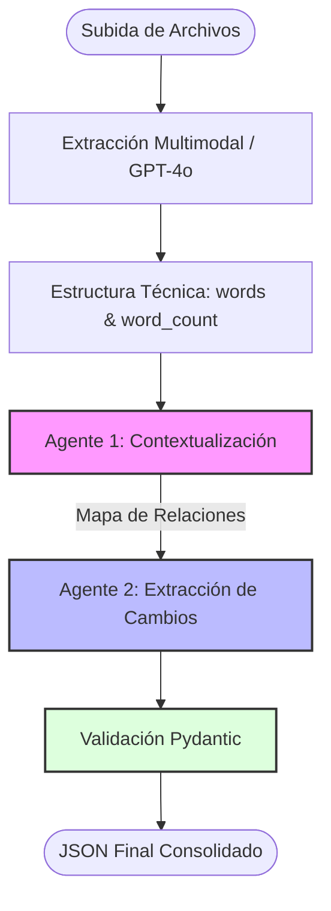

# 🚀 LegalMove: Agente Autónomo de Comparación de Contratos

Este sistema utiliza Inteligencia Artificial multimodal y una arquitectura de **Multi-Agentes** para automatizar la auditoría de contratos legales. El pipeline procesa documentos originales y sus adendas para extraer cambios, evaluar impactos y generar reportes estructurados.

---


## Stack

| Layer | Tech |
|---|---|
| Backend | FastAPI + langchain+ Langfuse + OpenAI |
| Frontend | React 18 + Vite 5 |

---


## 🏗️ Flujo del Pipeline (Arquitectura)

El sistema transforma píxeles de imágenes o PDFs en conocimiento legal estructurado siguiendo este flujo:




### ⚙️ Instalación

### 1. Clonar / descomprimir el proyecto

```bash
cd dragndropjson
```


### 2. Backend


```bash
cd backend

python -m venv venv             # Crear entorno virtual(r ecomendado)
source venv/bin/activate        # macOS/Linux
venv\Scripts\activate           # Windows

pip install -r requirements.txt
uvicorn main:app --reload --port 8000
```

API → http://localhost:8000  
Docs → http://localhost:8000/docs

---

### 3. Frontend

Open a second terminal:

```bash
cd frontend
npm install
npm run dev
```

App → http://localhost:5173

---

## API

### POST /extract

Multipart form-data:
- `file1` — PDF or image
- `file2` — PDF or image

Response:
```json
{
  "document.pdf": {
    "word_count": 142,
    "words": ["hello", "world", "..."]
  },
  "photo.png": {
    "word_count": 37,
    "words": ["invoice", "total", "..."]
  }
}
```

Supported formats: PDF · PNG · JPG · WEBP · TIFF · BMP

---

## How it works

- **PDF** → gpt-4o reads the pdf and extract the text
- **Images** → gpt-4o reads the image and extract the text
- **Proxy** → Vite forwards `/extract` to FastAPI, so no CORS issues
